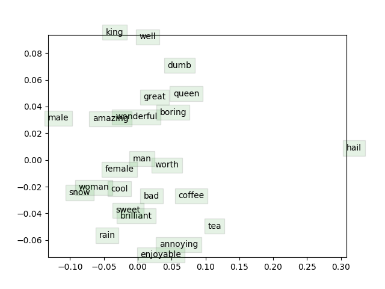

# CS 224n Assignment #2 Written Part

## (a)

### $$-\displaystyle\sum_{w \in V ocab}y_wlog(\hat{y}_w)=-[y_1log(\hat{y}_1)+\cdots+y_olog(\hat{y}_o)+\cdots+y_wlog(\hat{y}_w)]$$

### $$\displaystyle=-[0 \cdot log(\hat{y}_1) +\cdots+ y_olog(\hat{y}_o)+\cdots+0 \cdot log(\hat{y}_w)]$$

### $$\displaystyle=-1 \cdot log(\hat{y}_o)=- log(\hat{y}_o)$$

## (b)

### $$\displaystyle\frac{\partial\pmb{J}_{naive-softmax}(\pmb{v_c},o,\pmb{U})}{\partial\pmb{v_c}}=-\frac{\partial log(\hat{y}_o)}{\partial\pmb{v_c}}=-\frac{\partial }{\partial\pmb{v_c}}log(\frac{exp(\pmb{u_o}^T\pmb{v_c})}{\sum_{w \in V ocab}exp(\pmb{u_w}^T\pmb{v_c})})$$

### $$\displaystyle=\frac{\partial}{\partial\pmb{v_c}}log[\sum_{w \in V ocab}exp(\pmb{u_w}^T\pmb{v_c})]-\frac{\partial\pmb{u_o}^T\pmb{v_c}}{\partial\pmb{v_c}}$$

### $$\displaystyle=\frac{\frac{\partial}{\partial\pmb{v_c}}\sum_{w \in V ocab}exp(\pmb{u_w}^T\pmb{v_c})}{\sum_{w \in V ocab}exp(\pmb{u_w}^T\pmb{v_c})}-\pmb{u_o}$$

### $$\displaystyle=(\sum_{w \in V ocab}\hat{y_w}\pmb{u_w})-\pmb{u_o}$$

### $$\displaystyle=(\hat{y_1}\pmb{u_1}-0\cdot \pmb{u_1})+\cdots+(\hat{y_o}\pmb{u_o}-1\cdot \pmb{u_o})+\cdots+(\hat{y_w}\pmb{u_w}-0\cdot \pmb{u_w})$$

### $$\displaystyle=\pmb{U}(\pmb{\hat{y}}-\pmb{y})$$

## (c)

### $$\displaystyle\frac{\partial\pmb{J}_{naive-softmax}(\pmb{v_c},o,\pmb{U})}{\partial\pmb{u_w}}=-\frac{\partial log(\hat{y}_o)}{\partial\pmb{u_w}}=-\frac{\partial }{\partial\pmb{u_w}}log(\frac{exp(\pmb{u_o}^T\pmb{v_c})}{\sum_{w \in V ocab}exp(\pmb{u_w}^T\pmb{u_c})})$$

### $$\displaystyle=\frac{\partial}{\partial\pmb{u_w}}log[\sum_{w \in V ocab}exp(\pmb{u_w}^T\pmb{v_c})]-\frac{\partial\pmb{u_o}^T\pmb{v_c}}{\partial\pmb{u_w}}$$

### When $w=o$, 

### $$\displaystyle=\frac{\frac{\partial}{\partial\pmb{u_o}}\sum_{w \in V ocab}exp(\pmb{u_w}^T\pmb{v_c})}{\sum_{w \in V ocab}exp(\pmb{u_w}^T\pmb{v_c})}-\frac{\partial\pmb{u_o}^T\pmb{v_c}}{\partial\pmb{u_o}}$$

### $$\displaystyle=\hat{y_o}\pmb{v_c}-\pmb{v_c}$$

### When $w\neq o$, 

### $$\displaystyle=\frac{\frac{\partial}{\partial\pmb{u_w}}\sum_{w \in V ocab}exp(\pmb{u_w}^T\pmb{v_c})}{\sum_{w \in V ocab}exp(\pmb{u_w}^T\pmb{v_c})}-\frac{\partial\pmb{u_o}^T\pmb{v_c}}{\partial\pmb{u_w}}$$

### $$\displaystyle=(\sum_{w \in V ocab,w \neq o}\hat{y_w}\pmb{v_c})-0=\sum_{w \in V ocab,w \neq o}\hat{y_w}\pmb{v_c}$$

### Therefore,

### $$\displaystyle\frac{\partial\pmb{J}_{naive-softmax}(\pmb{v_c},o,\pmb{U})}{\partial\pmb{u_w}}=(\sum_{w \in V ocab}\hat{y_w}\pmb{v_c})-\pmb{v_c}$$

### $$\displaystyle=(\hat{y_1}\pmb{v_c}-0\cdot \pmb{v_c})+\cdots+(\hat{y_o}\pmb{v_c}-1\cdot \pmb{v_c})+\cdots+(\hat{y_w}\pmb{v_c}-0\cdot \pmb{v_c})$$

### $$\displaystyle=\pmb{v_c}(\pmb{\hat{y}}-\pmb{y})^T$$

## (d)

### $$\displaystyle\frac{d\sigma(\pmb{x})}{d\pmb{x}}=\frac{d}{d\pmb{x}}\frac{e^{\pmb{x}}}{e^{\pmb{x}}+1}=0-\frac{d}{d\pmb{x}}\frac{1}{e^{\pmb{x}}+1}=\frac{e^{\pmb{x}}}{(e^{\pmb{x}}+1)^2}$$

## (e)

### $$\displaystyle\frac{\frac{d\sigma(\pmb{x})}{d\pmb{x}}}{\sigma(\pmb{x})}=\frac{\frac{e^{\pmb{x}}}{(e^{\pmb{x}}+1)^2}}{\frac{e^{\pmb{x}}}{e^{\pmb{x}}+1}}=\frac{1}{e^{\pmb{x}}+1}=\sigma(-\pmb{x})$$

### $$\displaystyle\frac{\partial\pmb{J}_{negative-sample}(\pmb{v_c},o,\pmb{U})}{\partial\pmb{v_c}}=-\frac{\partial }{\partial\pmb{v_c}}log(\sigma(\pmb{u_o}^T\pmb{v_c}))-\frac{\partial }{\partial\pmb{v_c}}\sum_{k=1}^K log(\sigma(-\pmb{u_k}^T\pmb{v_c}))$$

### $$\displaystyle=-\frac{\frac{\partial }{\partial\pmb{v_c}}\sigma(\pmb{u_o}^T\pmb{v_c})}{\sigma(\pmb{u_o}^T\pmb{v_c})}-\sum_{k=1}^K\frac{\frac{\partial}{\partial\pmb{v_c}}\sigma(-\pmb{u_k}^T\pmb{v_c})}{\sigma(-\pmb{u_k}^T\pmb{v_c})}$$

### $$\displaystyle=-\sigma(-\pmb{u_o}^T\pmb{v_c})\cdot\pmb{u_o}+\sum_{k=1}^K\sigma(\pmb{u_k}^T\pmb{v_c})\cdot\pmb{u_k}$$

### $$\displaystyle\frac{\partial\pmb{J}_{negative-sample}(\pmb{v_c},o,\pmb{U})}{\partial\pmb{u_o}}=-\frac{\partial }{\partial\pmb{u_o}}log(\sigma(\pmb{u_o}^T\pmb{v_c}))-\frac{\partial }{\partial\pmb{u_o}}\sum_{k=1}^K log(\sigma(-\pmb{u_k}^T\pmb{v_c}))$$

### $$\displaystyle=-\frac{\frac{\partial }{\partial\pmb{u_o}}\sigma(\pmb{u_o}^T\pmb{v_c})}{\sigma(\pmb{u_o}^T\pmb{v_c})}-0=-\sigma(-\pmb{u_o}^T\pmb{v_c})\cdot\pmb{v_c}$$

### $$\displaystyle\frac{\partial\pmb{J}_{negative-sample}(\pmb{v_c},o,\pmb{U})}{\partial\pmb{u_k}}=-\frac{\partial }{\partial\pmb{u_k}}log(\sigma(\pmb{u_o}^T\pmb{v_c}))-\frac{\partial }{\partial\pmb{u_k}}\sum_{k=1}^K log(\sigma(-\pmb{u_k}^T\pmb{v_c}))$$

### $$\displaystyle=-0-0-\cdots-\frac{\frac{\partial }{\partial\pmb{u_k}}\sigma(-\pmb{u_k}^T\pmb{v_c})}{\sigma(-\pmb{u_k}^T\pmb{v_c})}-0-\cdots-0=\sigma(\pmb{u_k}^T\pmb{v_c})\cdot\pmb{v_c}$$

### It is much more efficient because with the aid of some tricks working out the derivative of sigmoid function is much easier than handling naive-softmax function.

## (f)

### $$\displaystyle\frac{\partial\pmb{J}_{skip-gram}(\pmb{v_c},w_{t-m},\cdots,w_{t+m},\pmb{U})}{\partial\pmb{U}}=\sum_{-m<j<m,j\neq0}\frac{\partial\pmb{J}_{skip-gram}(\pmb{v_c},w_{t+j},\pmb{U})}{\partial\pmb{U}}$$

### $$\displaystyle\frac{\partial\pmb{J}_{skip-gram}(\pmb{v_c},w_{t-m},\cdots,w_{t+m},\pmb{U})}{\partial\pmb{v_c}}=\sum_{-m<j<m,j\neq0}\frac{\partial\pmb{J}_{skip-gram}(\pmb{v_c},w_{t+j},\pmb{U})}{\partial\pmb{v_c}}$$

### $$\displaystyle\frac{\partial\pmb{J}_{skip-gram}(\pmb{v_c},w_{t-m},\cdots,w_{t+m},\pmb{U})}{\partial\pmb{v_w}}=0$$

## [My Word Vector]

### Some words describing feelings or emotions like "enjoyable" and "annoying", "amazing" and "wonderful" cluster together. If we have the word vector of "male" minus "female" and the result will approximately equal the word vector of "king" minus "queen".