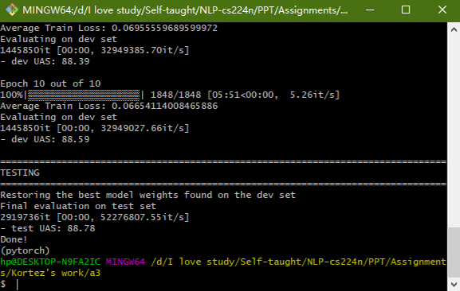

# CS 224n Assignment #3 Written Part

## 1.

### (a)

#### (i)

When $\nabla_{\theta} J_{minibatch}(\theta)$ first reaches zero, the algorithm will not stop immediately, so that it is possible to escape from local optimum. Then when sign of $\nabla_{\theta} J_{minibatch}(\theta)$ becomes negative, **m** will be diminished and the speed of the shrinking of $\theta$ will slow down. Therefore, the update will not vary as much. In a nutshell, **m** helps to make sure that the update will not vary too much when the direction is opposite to the accumulated gradient, and that the learning will converge.

#### (ii)

The model parameter **v** will get larger updates when $\nabla_{\theta} J_{minibatch}(\theta)$ is big, while when $\nabla_{\theta} J_{minibatch}(\theta)$ is small the model parameter **m** will get larger ones. This help with learning in that it slows down the speed of learning with the increase of iterates, which is of benefit as it is expected to be nearer the optimum.

### (b)

#### (i)

$\displaystyle\gamma=\frac{1}{1-p_{drop}}$

$\because\Bbb{E}_{p_{drop}}[h_{drop}]_i=p_{drop}\cdot0+(1-p_{drop})\cdot1\cdot\gamma\circ h_{i}=\displaystyle\frac{1-p_{drop}}{1-p_{drop}}\cdot h_{i}=h_{i}$

#### (ii)

During training we apply dropout so as to train with loads, thus during evaluation when loads are taken off out model may have a better performance.

## 2.

### (a)

|             Stack              |                 Buffer                 |        New Dependency        |      Transition       |
| :----------------------------: | :------------------------------------: | :--------------------------: | :-------------------: |
|             [ROOT]             | [I, parsed, this, sentence, correctly] |                              | Initial Configuration |
|           [ROOT, I]            |  [parsed, this, sentence, correctly]   |                              |        *SHIFT*        |
|       [ROOT, I, parsed]        |      [this, sentence, correctly]       |                              |        *SHIFT*        |
|         [ROOT, parsed]         |      [this, sentence, correctly]       |     parsed$\rightarrow$I     |      *LEFT-ARC*       |
|      [ROOT, parsed, this]      |         [sentence, correctly]          |                              |        *SHIFT*        |
| [ROOT, parsed, this, sentence] |              [correctly]               |                              |        *SHIFT*        |
|    [ROOT, parsed, sentence]    |              [correctly]               |  sentence$\rightarrow$this   |      *LEFT-ARC*       |
|         [ROOT, parsed]         |              [correctly]               | parsed$\rightarrow$sentence  |      *RIGHT-ARC*      |
|   [ROOT, parsed, correctly]    |                   []                   |                              |        *SHIFT*        |
|         [ROOT, parsed]         |                   []                   | parsed$\rightarrow$correctly |      *RIGHT-ARC*      |
|             [ROOT]             |                   []                   |   root$\rightarrow$parsed    |      *RIGHT-ARC*      |

### (b)

A sentence containing n words will be parsed in $2n$ times, for that every step we either do *SHIFT* or do *LEFT/RIGHT-ARC*.  Every word need **one** *SHIFT* and **one** *LEFT/RIGHT-ARC* to be parsed. Therefore, $n$ words need to be parsed in $2n$ times.

### (f)

#### (i)

Error type: Verb Phrase Attachment Error

Incorrect dependency: wedding$\rightarrow$fearing

Correct dependency:  heading$\rightarrow$fearing

#### (ii)

Error type: Coordination Attachment Error

Incorrect dependency: makes$\rightarrow$rescue

Correct dependency:  rush$\rightarrow$rescue

#### (iii)

Error type: Prepositional Phrase Attachment Error

Incorrect dependency: named$\rightarrow$Midland

Correct dependency:  guy$\rightarrow$Midland

#### (iv)

Error type: Modifier Attachment Error

Incorrect dependency: element$\rightarrow$most

Correct dependency:  crucial$\rightarrow$most

## My Model Report

dev UAS: 88.59

test UAS: 88.78