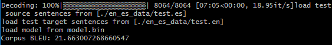

# CS 224n Assignment #4 Written Part

## 1.

### (g)

In the `step()` function, masks are used to set positions corresponding the 'pad' tokens in *e_t* to be *-infinity*. 

`e_t.data.masked_fill_(enc_masks.byte(), -float('inf'))`

And then the value of such positions in *alpha_t* after 'softmax' will be very small, and their attention score *a_t* will also be small after batched matrix multiplication. Therefore, these  'pad' tokens will be overlooked.

This is necessary because we do hope that the model will ignore the significance of the 'pad' tokens we put in the sentence rather than consider them to be certain words with certain meanings.

### (i)

BLEU: 23.96389959977315

### (j)

Dot product attention: Fast to compute and convenient, but not powerful and ideal.

Multiplicative attention: More functional but slower to train.

Additive attention: Most flexible and adaptive but most time-consuming and need plenty of data for training since there are more parameters to be learned.

## 2.

### (a)

#### i.

**Error:** The phrase 'favorite of my favorites' should be 'one of my favorites'.

**Possible Reason:** Perhaps the machine does not understand certain phrases.

**Possible Resolution:** Maybe viewing phrases as words when training can help.

#### ii.

**Error:** The phase 'ms ledo' is translated to 'more read', but 'the most widely read' is correct.

**Possible Reason:** The machine can't tell comparative forms from superlative forms and the adverb is not given here.

**Possible Resolution:** We may let the machine add some words when decoding to make the sentence more fluent.

#### iii.

**Error:** The word 'Bolingbroke' is translated to '<unk>'.

**Possible Reason: **The word 'Bolingbroke' is an out-of-vocabulary word which cannot be recognized.

**Possible Resolution: **We may let the machine output the word itself when meeting an unknown word.

#### iv.

**Error: **The word 'manzana' here means 'a block' instead of 'an apple'.

**Possible Reason:** The machine doesn't choose the correct meaning of the polynomial word.

**Possible Resolution:** We may use special word embeddings which separate polynomial words, which may improve the ability to select the proper meaning.

#### v.

**Error:** The word 'profesores' is not translated.

**Possible Reason:** Maybe the machine pays too much attention to 'she' when and ignores 'profesores'.

**Possible Resolution:** We may choose attention mechanisms which ensures every word be paid considerable attention to at least once.

#### vi.

**Error:** Actually 100,000 hectareas equals 250,000 acres, but 100,000 is given.

**Possible Reason:** The machine knows that hectareas is a spatial unit, but it don't know how many acres is one hectarea.

**Possible Resolution:** We may add special rules to translate those a number and a unit noun phrases.

### (b)

#### i.

**Source Sentence:** Lo haca en secreto,

**Reference Translation:** She did it in secret.

**NMT Translation:** He did it in secret it.

**Error:** A redundant 'it' is given at the end.

**Possible Reason:** Repeated words which undermines the structure of the sentence can get higher scores without punishment.

**Possible Resolution: **We may add punishment to repeated words in close distance when decoding.

#### ii.

**Source Sentence:** Esta es una representacin de tu cerebro que podemos dividir en dos partes.

**Reference Translation:** This is a representation of your brain,  and your brain can be broken into two parts.

**NMT Translation: **This is a representation of your brain that we can split in two parts.

**Error:** The wrong use of preposition 'in': 'into' is needed here.

**Possible Reason:** The word 'en' is much more frequently to be translated to 'in' than 'into'.

**Possible Resolution:** We may find more data to train the model.

### (c)

#### (i)

$$c_1:$$

$$p_1=\frac{3}{5},p_2=\frac{2}{4},c=5,r^*=4,BP=1$$

$$BLEU=1\times exp(0.5log\frac{3}5+0.5log\frac{2}4)=0.76994$$

$$c_2:$$

$$p_1=\frac{4}{5},p_2=\frac{2}{4},c=5,r^*=4,BP=1$$

$$BLEU=1\times exp(0.5log\frac{4}5+0.5log\frac{2}4)=0.81957$$

According to *BLEU* score, the second translation is a better one. I agree with this judgment.

#### (ii)

$$c_1:$$

$$p_1=\frac{3}{5},p_2=\frac{2}{4},c=5,r^*=6,BP=0.81873$$

$$BLEU=0.81873\times exp(0.5log\frac{3}5+0.5log\frac{2}4)=0.63038$$

$$c_2:$$

$$p_1=\frac{2}{5},p_2=\frac{1}{4},c=5,r^*=6,BP=0.81873$$

$$BLEU=0.81873\times exp(0.5log\frac{2}5+0.5log\frac{1}4)=0.49659$$

According to *BLEU* score, the first translation is a better one. I disagree with this judgment.

#### (iii)

When only a single reference translation is provided, many also reasonable translations may be regarded as wrong ones. And then it is possible that sentences similar to the unique reference but meaningless may get a high score while those whose meanings are correct but given in other words may get a low score.

#### (iv)

Advantages: Time-saving and more convenient; Not requiring understanding these languages.

Disadvantages: Problematic while references are not enough; Not considering the fluency and the correctness of structure of the sentences.

