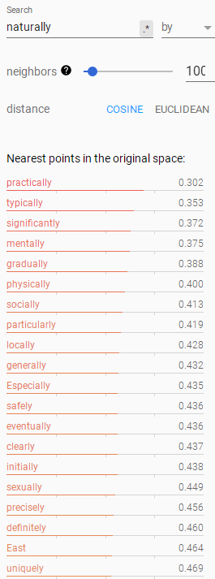

# CS 224n Assignment #5 Written Part

## 1.

### (a)

Because the total number of the characters is typically smaller than the total number of the words. Additionally, a single word is likely to have a couple of characters, whose vectors are combined to be enough to hold the information of the word.

### (b)

Character-based embedding model: 
$$
e_{char}\times V_{char}+k\times e_{char}\times e_{word}+e_{word}+2\times e_{word}\times e_{word}+2\times e_{word}
$$

$$
=e_{char}\times V_{char}+k\times e_{char}\times e_{word}+2\times e_{word}\times e_{word}+3\times e_{word}
$$

Word-based embedding model:  
$$
e_{word}\times V_{word}
$$
Word-based embedding model has more parameters, by as 637 times many.

### (c)

When a 1D convnet computes features for a given window of the input, it learns pieces of sentences. By contrast, an RNN, though maybe bi-directional, can only learn the sentence in an integrated way. Therefore, unlike a RNN, a convnet can learn the meanings of pieces of sentences such as phrases better.

### (d)

Max-pooling only needs to work out the maximum of inputs, while average-pooling needs to handle all inputs, which renders max-pooling a little bit faster and more convenient. What's more, when inputs are sparse, max-pooling can provide the most significant information while average-pooling may give a rather small value.

Average-pooling can represent the meaning of all inputs in a synthetic way while max-pooling only provides the information of the maximum. Therefore, when the inputs are similar, average-pooling is more accurate.

## 2.

BLEU: 24.29222811461412

## 3.

### (a)

As is shown in the picture, *traducir* and *traduce* occur while others don't.

This is bad for word-based NMT because it views them as totally different words and cannot understand their relationship.

In our new character-aware NMT model, the embedding of a word is up to its the embeddings of its characters. Thus, our model can recognize the similarity of these words and can learn better.

### (b)

#### (i)

#### (ii)

#### (iii)

In Word2Vec, words those show up in similar contexts will be close to each other, while in CharCNN, spelling similarity is modeled.

For instance, 'neuron' is near 'Newton' in CharCNN. They are nothing but similar in spelling. In Word2Vec it's near 'nerve', which makes sense and is more acceptable.

### (c)

#### (acceptable example)

**Source sentence:** En uno de mis roles, trabajo con la historia de la anatoma.

**Reference translation:** As the one hat,  I do history of anatomy.

**A4 translation:** In one of my **\<unk\>** I work with the history of anatomy.

**A5 translation:** In one of my **roles** -- I work with the history of the anatomy.

**Comment:** This is acceptable because the word 'role' in Spanish just means role in English.

**Possible Explanation:** The character-based model finds that the word 'roles' itself can fit well in this context and just leave it unchanged.

#### (incorrect example)

**Source sentence:** Producimos andrgenos y respondemos a los andrgenos.

**Reference translation:** We're making androgen, and we're responding to androgens.

**A4 translation:** We produce **\<unk\>** and we respond to the **\<unk\>**.

**A5 translation:** We produce **angers** and respond to **angers**.

**Comment:** This is incorrect because the word 'andrgenos' in Spanish means androgen in English.

**Possible Explanation:** The character-based model finds that the word 'anger' is similar to ''andrgenos', and that quite fits the sentences given the context indeed.